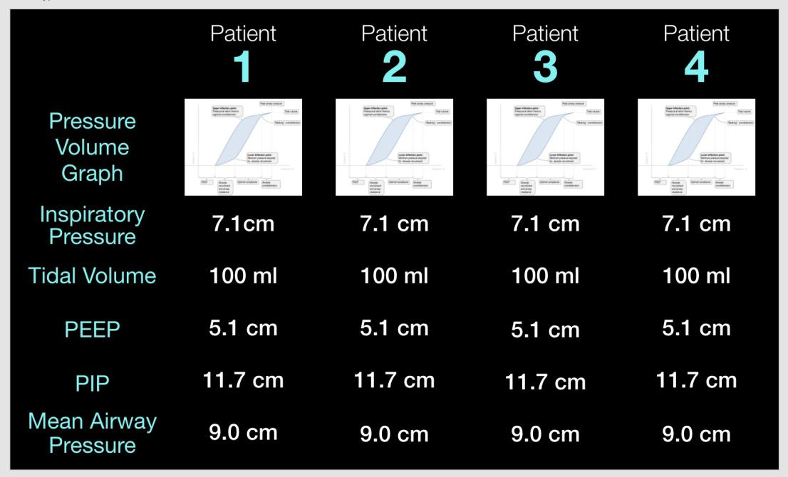

How to turn on the Tetra Ventillator Splitter
=============================================

1. Ensure that the splitter is connected to a power supply

2. Ensure that the airlines connecting the splitter and ventillator are attached (detailed in a serperate document)

3. Flip the on-off switch to on

4. After a short boot-up sequence, a screen showing data for each of the patient airlines should appear, which looks like this

  

  - If instead a computer desktop appears, connect a mouse to the USB port on the splitter and double-click on the "Tetra Splitter Data Readout" icon

  - If there is no such icon, ensure that the Tetra Ventillator Splitter software is installed

5. Verify that all the air connections are good

  1. Plug the ends of all patient connections

  2. Begin running the ventillator

  3. The numbers on the Airline Data Information Screen should be changing

     - If the numbers are not changing, make sure the stop valves for each airline is open

  4. Turn the knobs on the control valves to ensure they're working correctly